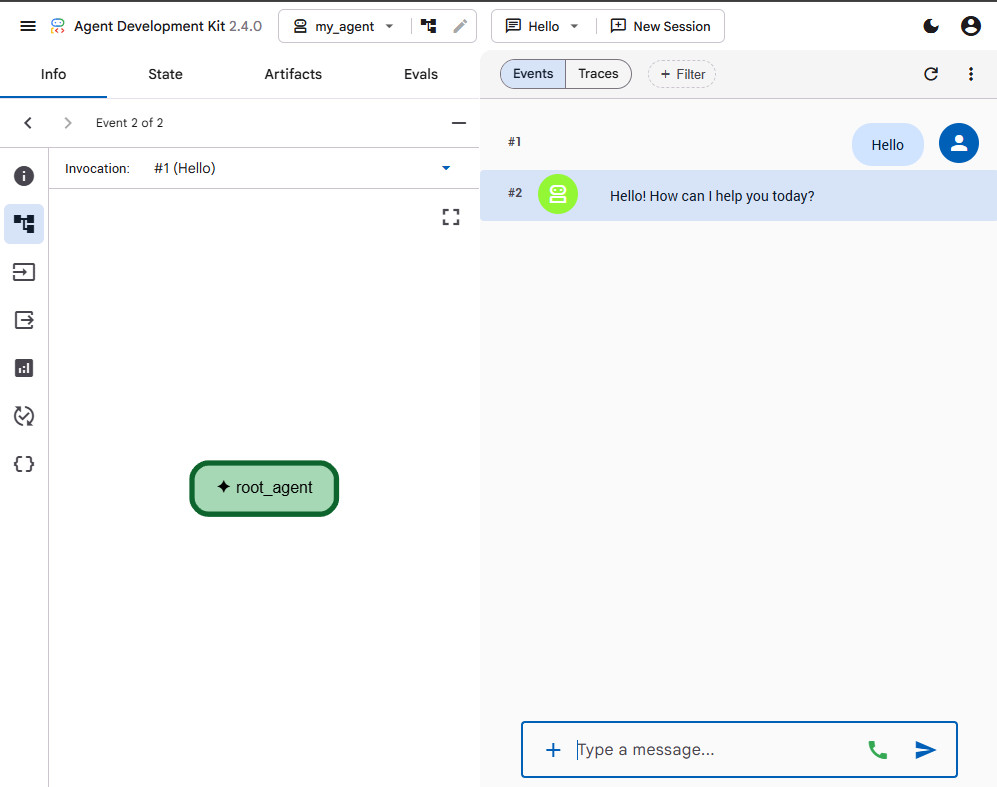

# Building Intelligent AI Agents with Antigravity IDE and Google Agent Development Kit (ADK)

This project contains a starter template for building, testing, and running AI agents using the **Google Agent Development Kit (ADK)**.

## Project Structure

```
.
├── my_agent/
│   ├── .env              # Local environment variables and credentials (ignored by Git)
│   ├── .gitignore        # Ignores .env file inside agent directory
│   ├── __init__.py       # Package initializer
│   └── agent.py          # Main agent definition and initialization logic
├── .gitignore            # Root level gitignore (ignores .venv, .adk database, etc.)
├── codelab.md            # A step-by-step tutorial guiding you through setup, configuration, and execution
└── README.md             # This file
```

---

## Quick Start

### 1. Prerequisites
Ensure you have **Python 3.10+** installed on your system.

### 2. Set Up the Virtual Environment
```bash
# Create virtual environment
python -m venv .venv

# Activate virtual environment (Windows Bash / Git Bash)
source ./.venv/Scripts/activate
```

### 3. Install Dependencies
```bash
pip install google-adk
```

### 4. Configure your Gemini API Key
Create or update `my_agent/.env` to include your Google Gemini API key:
```ini
GOOGLE_GENAI_USE_ENTERPRISE=0
GOOGLE_API_KEY=YOUR_GEMINI_API_KEY
```
You can generate a free key from the [Google AI Studio Console](https://aistudio.google.com/apikey).

---

## Running the Agent

### CLI Mode (Interactive Chat in Terminal)
```bash
# Optional: force UTF-8 output to prevent encoding crashes with emojis on Windows
export PYTHONIOENCODING="utf-8"

adk run my_agent
```

### Web UI Mode (FastAPI Local Webserver)
```bash
adk web my_agent
```
Open your browser and navigate to `http://127.0.0.1:8000` to interact with the agent using the developer interface.




---

## Deploying the Agent

Package your agent to run in production using **Google Cloud Run**, **Google App Engine**, **Google Kubernetes Engine**, or **Google Compute Engine**.

---

## Documentation & Resources

* **Step-by-Step Codelab:** Refer to the [codelab.md](codelab.md) file for a detailed tutorial on workspace setup, customizing instructions, and using the CLI or Web UI.
* **Official SDK:** Learn more at the official [Google ADK GitHub Repository](https://github.com/google/adk-python).

